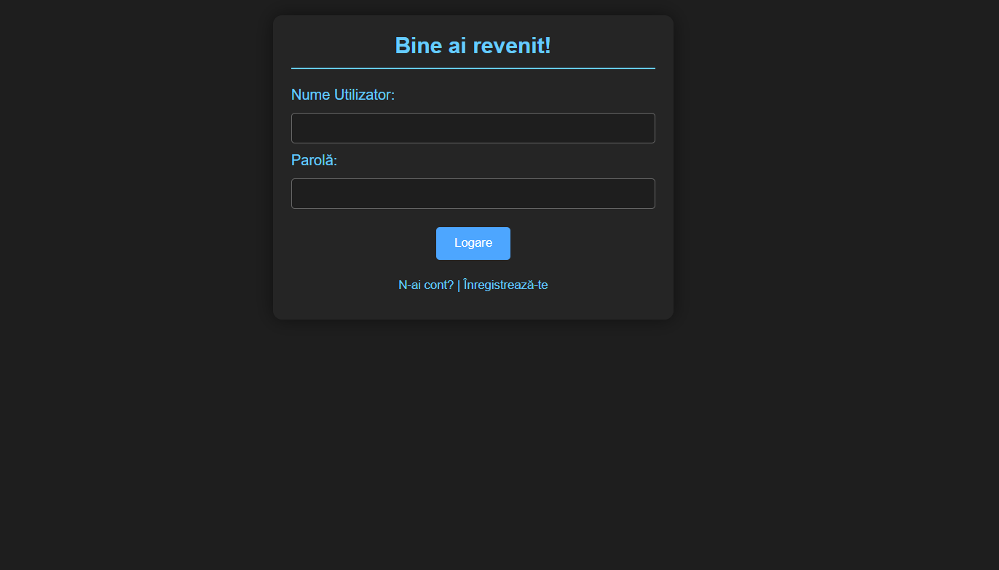
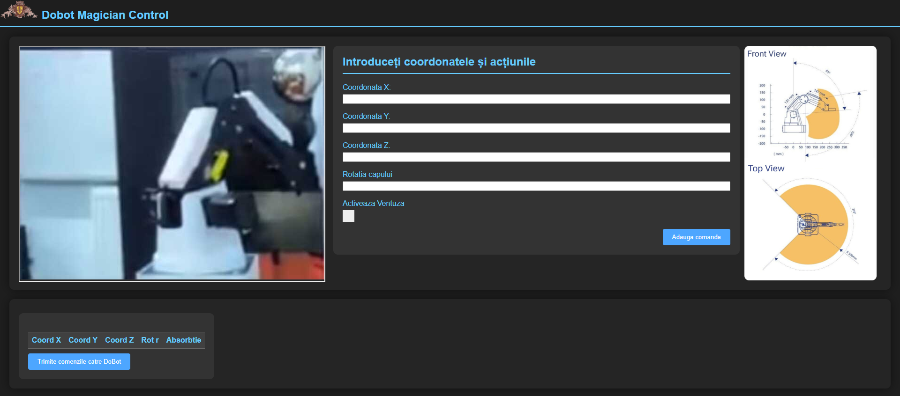

# DoBotMagicianForEducation

DOBOT Magician este un robot multifuncțional și versatil, conceput pentru a imbunătăți experiența educaționala în diverse domenii, în special în STEAM (Știință, Tehnologie, Inginerie, Artă și Mecanică), cu ajutorul paginii web ce oferă o experiență mult mai ușoară în a-l controla. DOBOT Magician permite elevilor să aplice teorie în practică prin experimente interactive și proiecte hands-on. Copiii pot explora funcționarea roboților, inclusiv aspecte precum controlul motoarelor, utilizarea senzorilor și execuția secvențelor de mișcare. Site-ul web este proiectat pentru a fi intuitiv și ușor de utilizat, facilitând interacțiunea elevilor cu brațul robotizat. În plus, pagină noastră oferă profesorilor șansă de a monitoriza progresul elevilor, evaluând performanțele.oriza progresul elevilor, evaluând performanțele.

## Design

## Funcționalități
- Opțiunea de logare pe pagina cun nume de utilizator și parolă
- Introducerea de coordonate pentru mișcarea robotului
- Afișarea în timp real a mișcării brațului
- Trimiterea a mai multor seturi de coordonate pentru o acțiune mai complexă mai complexă

## Descriera Tehnică

Proiectul utilizează un Raspberry Pi 4 care funcționează pe post de server pentru DOBOT Magician, la care este conectat prin USB pentru a facilita o comunicare rapidă, acesta gestionează comunicarea între componentele sistemului și vizualizarea streamingului video de pe camera montată pe Raspberry în timp realreal. Raspberry-ul este plasat într-o [carcasă 3D](RaspiCase.step) personalizată, proiectată și creată de noi pentru a se mula pe nevoile proiectului nostru și pentru a oferi un aspect plăcut.

#### Streaming Video

**video.py**

Acest script gestionează streaming-ul video folosind biblioteca Picamera2. Camera Raspberry Pi captează cadre și le transmite în timp real pe portul 8000 în format MJPEG. Serverul de streaming video procesează și cereri HTTP POST, permițând adăugarea de text peste video. Acest text este afișat în timp real pe feed-ul video transmis către interfața web.

**video-server.service**

Pentru a asigura că serverul de streaming video rulează continuu, `video-server.service` este configurat să pornească automat la boot-ul Raspberry Pi și să ruleze în background. Acest serviciu se asigură că utilizatorii pot vizualiza fluxul video live oricând doresc (systemctl enable video-server).

#### Controlul Brațului Robotic

**Dobot.py**

programul in python are ca argumente 
x - coordonata x (int)
y - coordonata y (int)
z - coordonata z (int)
r - rotatia capului (float)
s - ventuza sau gripperul (boolean)
u - userul (str)
argumentele sunt folosite pentru a transmite comanda de deplasare la coordoonatele x,y,z,r si pentru a transmite o cerere HTTP tip POST catre serverul de streaming cu mesajul ce va fi afisat, in format JSON
print_messaje(mesaj) - transmite cereri HTTP POST folosind libraria requests iar mesajul este convertit in format JSON cu ajutorul librariei json
dobot_move_to(x,y,z,r) -deplaseaza bratul la coordonatele respective este un program python ce foloseste o interfata multiplatforma pentru bratul robotic Dobot Magician

### Structura Datelor

Fisierele sunt distribuite in urmatoarele directooare 
raspberry pi 
├── var 
│&nbsp;&nbsp;&nbsp;└── www 
│&nbsp;&nbsp;&nbsp;&nbsp;&nbsp;&nbsp;&nbsp;└──html 
│&nbsp;&nbsp;&nbsp;&nbsp;&nbsp;&nbsp;&nbsp;&nbsp;&nbsp;&nbsp;└──index.php 
│&nbsp;&nbsp;&nbsp;&nbsp;&nbsp;&nbsp;&nbsp;&nbsp;&nbsp;&nbsp;└──DobotControlPanel.php 
│&nbsp;&nbsp;&nbsp;&nbsp;&nbsp;&nbsp;&nbsp;&nbsp;&nbsp;&nbsp;└──procesare_inregistrari.php 
├── lib 
│&nbsp;&nbsp;&nbsp;└── systemd 
│&nbsp;&nbsp;&nbsp;&nbsp;&nbsp;&nbsp;&nbsp;└──system 
│&nbsp;&nbsp;&nbsp;&nbsp;&nbsp;&nbsp;&nbsp;&nbsp;&nbsp;&nbsp;└──video-server.service 
├── root 
&nbsp;&nbsp;&nbsp;└── video.py 
Procesul de înregistrare este gestionat de un script PHP numit `procesare_inregistrari.php`. Acest script primește cererile HTTP POST transmise de către formularul de înregistrare și le procesează în consecință. În cadrul acestui script, numele de utilizator introdus este verificat pentru a se asigura că respectă cerințele (fără spații sau caractere speciale), iar parola este criptată folosind funcția `password_hash()` pentru a asigura securitatea datelor. Parola criptată este apoi stocată într-un tabel dintr-o baza de date MySQL împreună cu numele de utilizator. Indexarea tabelului se face cu ajutorul id-ului utilizatorului.

Pentru autentificare, când utilizatorii încearcă să se conecteze, numele de utilizator și parola lor sunt trimise din nou către server prin formularul de autentificare `index.php`. Scriptul PHP asociat verifică dacă numele de utilizator există în baza de date și apoi compară parola introdusă cu cea stocată înregistrată anterior, folosind funcția password_verify() pentru a verifica dacă parolele coincid. Dacă autentificarea este reușită, utilizatorul este redirecționat către pagina principală a aplicației, altfel, este afișat un mesaj de eroare.
Aceste procese sunt esențiale pentru a asigura securitatea și funcționalitatea sistemului. Utilizarea criptării parolelor este o practică standard pentru a proteja datele utilizatorilor împotriva accesului neautorizat.

## Plan de dezvoltare
- Adăugarea si altor funcționalități precum posibilitatea de a face desene, grava lase și de printare 3D
- Actualizare designul-ui paginii web pentru a fi mai ușor de utilizat
- Sporirea securității si autentificare prin email

## Concluzie

Proiectul reprezintă o combinație ingenioasă între tehnologie și educație, oferind o experiență interactivă și captivantă pentru copii. Prin integrarea unui braț robotic controlat de Raspberry Pi și un sistem de streaming video, copiii au oportunitatea de a explora lumea tehnologiei într-un mod distractiv și educativ.
Feedback-ul și aprecierile primite de la copii confirmă impactul pozitiv al proiectului în stimularea interesului și pasiunii lor pentru știință și tehnologie. Prin intermediul acestei inițiative inovatoare, copiii au oportunitatea de a descoperi și de a experimenta noțiuni complexe într-un mod accesibil și distractiv, pregătindu-i pentru provocările viitorului digital.
